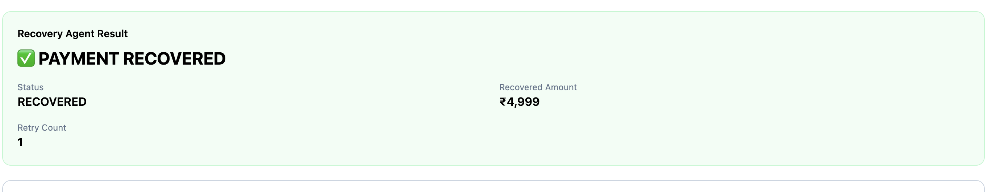

# 💸 PayFlow

> **A full-stack digital payment and personal finance management platform with AI-powered financial intelligence and intelligent payment recovery.**

PayFlow is a modern full-stack payment application designed to simulate real-world digital wallet functionality while providing users with powerful financial analytics, AI-powered financial assistance, and an intelligent payment recovery system.

Users can create accounts, manage their wallet balance, transfer money, receive money, track transactions, analyze spending patterns, interact with an AI financial assistant, and recover eligible failed payments using **PayRescue AI**.

---

## 🚀 Live Demo

### 🌐 Frontend

https://payflow-git-main-mohdfarahidali987-sketchs-projects.vercel.app/signin

### ⚙️ Backend API

https://payflow-backend-9314.onrender.com

### 🧠 PayRescue ML Service

https://payrescue-ml.onrender.com

### ❤️ ML Service Health

https://payrescue-ml.onrender.com/health

---

# 📸 Screenshots

## 🔐 Sign Up


---

## 🔑 Sign In


---

## 📊 Dashboard


---

## 💸 Send Money


---

## 🤖 PayFlow AI

<!-- Add screenshot here -->


---

## 🤖 PayRescue AI

<!-- Add screenshot here -->


---

## 🧠 ML Payment Analysis

<!-- Add screenshot here -->


---

## 🔄 AI Recovery Decision

<!-- Add screenshot here -->




---

## 📜 Transaction History

<!-- Add screenshot here -->


---

# 🎥 Demo Video

> Add the complete project demonstration video here.

**Demo Video:**

[▶️ Watch PayFlow Demo](#)

### Recommended Demo Flow

```text
1. Sign Up / Sign In
2. Open Dashboard
3. View Account Balance
4. Search Users
5. Send Money
6. View Transaction History
7. Filter / Search Transactions
8. View Financial Analytics
9. Ask PayFlow AI a question
10. Generate Spending Insight
11. Generate Monthly Summary
12. Create Failed Payment
13. Analyze Failed Payment
14. View ML Recovery Probability
15. View Risk Level
16. View AI Recovery Decision
17. View Recovery Policy
18. Execute Recovery Action
19. View Recovery Result
```

---

# 📌 Table of Contents

- [Overview](#-overview)
- [Problem Statement](#-problem-statement)
- [Solution](#-solution)
- [Core Features](#-core-features)
- [Authentication](#-authentication)
- [Digital Wallet](#-digital-wallet)
- [Money Transfer](#-money-transfer)
- [User Search](#-user-search)
- [Transaction Management](#-transaction-management)
- [Financial Analytics](#-financial-analytics)
- [PayFlow AI](#-payflow-ai)
- [PayRescue AI](#-payrescue-ai)
- [Machine Learning Recovery Engine](#-machine-learning-recovery-engine)
- [AI Recovery Decision Engine](#-ai-recovery-decision-engine)
- [Recovery Safety Policy](#-recovery-safety-policy)
- [Recovery Agent](#-recovery-agent)
- [System Architecture](#-system-architecture)
- [Technology Stack](#-technology-stack)
- [Project Structure](#-project-structure)
- [API Overview](#-api-overview)
- [ML API](#-ml-api)
- [Environment Variables](#-environment-variables)
- [Local Development](#-local-development)
- [Deployment](#-deployment)
- [Security](#-security)
- [End-to-End Example](#-end-to-end-example)
- [Future Improvements](#-future-improvements)
- [Author](#-author)

---

# 🚀 Overview

PayFlow combines traditional payment functionality with modern AI and Machine Learning capabilities.

The platform consists of three major layers:

```text
┌───────────────────────────────────────────────┐
│                  PayFlow UI                   │
│              React + TypeScript               │
└───────────────────────┬───────────────────────┘
                        │
                        ▼
┌───────────────────────────────────────────────┐
│              PayFlow Backend                  │
│           Node.js + Express + TS              │
└───────────────┬───────────────┬───────────────┘
                │               │
                ▼               ▼
       ┌────────────────┐   ┌────────────────┐
       │ MongoDB Atlas  │   │   AI Services  │
       │                │   │     Groq       │
       └────────────────┘   └───────┬────────┘
                                    │
                                    ▼
                            ┌─────────────────┐
                            │ PayRescue ML    │
                            │ Python + Flask  │
                            └─────────────────┘
```

---

# 🎯 Problem Statement

Traditional digital payment applications generally focus on basic payment operations:

```text
Send Money
     ↓
Payment
     ↓
Transaction
```

However, modern financial applications need to provide more intelligence.

Users need to understand:

- Where their money is going
- How much they are spending
- Which categories consume most of their money
- What their monthly financial situation looks like

Similarly, failed payments should not simply end with:

```text
Payment Failed
```

Different payment failures require different responses.

For example:

```text
BANK_ERROR
    ↓
Temporary issue
    ↓
Retry may succeed
```

while:

```text
INVALID_DETAILS
    ↓
Invalid payment information
    ↓
Retry should not happen
```

PayFlow addresses both problems by combining:

```text
Payments
+
Financial Analytics
+
Generative AI
+
Machine Learning
+
Recovery Decision Making
```

---

# 💡 Solution

PayFlow provides a complete financial management platform.

```text
                         PAYFLOW
                            │
            ┌───────────────┼───────────────┐
            │               │               │
            ▼               ▼               ▼
        Payments        Analytics        AI Layer
            │               │               │
            │               │        ┌──────┴──────┐
            │               │        │             │
            ▼               ▼        ▼             ▼
      Transactions      Insights   PayFlow AI   PayRescue
                                                    │
                                                    ▼
                                             ML Prediction
                                                    │
                                                    ▼
                                             AI Decision
                                                    │
                                                    ▼
                                            Safety Policy
                                                    │
                                                    ▼
                                            Recovery Agent
```

---

# ✨ Core Features

# 🔐 Authentication

PayFlow provides secure user authentication.

### Features

- User registration
- User login
- JWT-based authentication
- Protected API routes
- Password hashing using bcrypt
- Authenticated sessions
- Current user profile
- User-specific account data

---

# 💰 Digital Wallet

Each PayFlow user has a digital wallet/account.

### Features

- Initial wallet balance
- View current balance
- Debit transactions
- Credit transactions
- Balance updates after successful transfers
- Account linked to authenticated user

Example:

```text
Available Balance

₹10,000
```

---

# 💸 Money Transfer

Authenticated users can transfer money to other PayFlow users.

### Transfer Flow

```text
Select User
     ↓
Enter Amount
     ↓
Enter Description
     ↓
Select Category
     ↓
Transaction Validation
     ↓
Balance Check
     ↓
Transfer
     ↓
Transaction Created
```

The backend verifies:

- Authentication
- Receiver ID
- Receiver existence
- Sufficient balance
- Valid transfer input

Users cannot transfer money to themselves.

---

# 👥 User Search

Users can search for other PayFlow users.

Search supports:

- First name
- Last name
- Case-insensitive search

Example:

```text
Search: "farahid"

        ↓

Muhammed Farahid
```

---

# 💳 Transaction Management

PayFlow maintains a complete transaction history.

Each transaction can contain:

```text
Transaction ID
Amount
Type
Direction
Status
Category
Description
Payment Method
Failure Reason
Retry Count
Recovery Probability
Recovery Action
Recovery Status
Recovered Amount
Recovery Reasoning
Anomaly Status
Sender
Receiver
Created At
Updated At
```

---

## Transaction Types

PayFlow supports:

```text
TRANSFER
```

with:

```text
DEBIT
CREDIT
```

directions.

---

## Transaction Status

Transactions can have statuses such as:

```text
SUCCESS
FAILED
```

Failed transactions can additionally participate in the PayRescue recovery pipeline.

---

## 🔎 Transaction Search

Users can search transactions by description.

Example:

```text
Search:
"food"
```

---

## 🏷️ Transaction Categories

Supported transaction categories include:

```text
Food
Travel
Shopping
Entertainment
Education
Healthcare
Utilities
Other
```

---

## 🔃 Transaction Sorting

Transaction history supports:

```text
Newest First
Oldest First
Amount Ascending
Amount Descending
```

---

## 📅 Date Filtering

Users can filter transactions using:

```text
From Date
To Date
```

---

## 📄 Pagination

Transaction history uses pagination to efficiently handle larger datasets.

---

# 📊 Financial Analytics

PayFlow provides a financial analytics dashboard.

The dashboard helps users understand their financial behavior.

### Analytics include:

- Current balance
- Total income
- Total expenses
- Monthly income
- Monthly expenses
- Transaction count
- Spending by category
- Category-wise spending
- Income vs expenses
- Monthly financial statistics

---

# 📈 Spending by Category

PayFlow analyzes spending according to transaction categories.

Example:

```text
Food             ₹4,200
Shopping         ₹3,100
Travel           ₹2,500
Entertainment    ₹1,200
Utilities        ₹1,000
```

The frontend visualizes this information using charts.

---

# 📊 Income vs Expenses

PayFlow provides an income-versus-expenses visualization.

Example:

```text
Income:

₹16,498


Expenses:

₹20,298
```

This allows users to quickly understand their monthly financial position.

---

# 🤖 PayFlow AI

PayFlow contains a dedicated AI-powered financial intelligence layer.

It provides:

```text
AI Financial Assistant
AI Spending Insights
AI Monthly Summary
AI Transaction Categorization
```

---

# 💬 AI Financial Assistant

Users can ask questions about their transaction history.

Example:

```text
How much did I spend on food this month?
```

The backend prepares relevant transaction data and provides it to the AI.

The AI is instructed to:

- Use only provided transaction data
- Never invent financial amounts
- Clearly state when information is insufficient
- Use Indian Rupees
- Avoid legal or tax advice

---

# 💡 AI Spending Insights

PayFlow can generate concise spending insights.

The AI provides:

### 1. Concrete Observation

Example:

```text
Your food expenses increased compared with the previous period.
```

### 2. Practical Recommendation

Example:

```text
Consider setting a monthly food budget.
```

The AI uses only the statistics supplied by the backend.

---

# 📅 AI Monthly Financial Summary

PayFlow can generate an AI-powered monthly summary.

The summary can contain:

- Total income
- Total expenses
- Top spending category
- Month-over-month change
- Financial recommendation

The generated summary is intentionally concise.

---

# 🏷️ AI Transaction Categorization

PayFlow can automatically categorize transaction descriptions using AI.

Example:

```text
Description:
"Bought groceries from supermarket"

             ↓

Category:
Food
```

If the AI is uncertain, the system falls back to:

```text
Other
```

The AI response is validated before the category is stored.

---

# 🤖 PayRescue AI

## Intelligent Payment Recovery System

PayRescue is the AI/ML-powered payment recovery subsystem of PayFlow.

Instead of simply marking a payment as failed, PayRescue determines:

```text
Can this payment be recovered?
        ↓
How likely is recovery?
        ↓
Is the transaction risky?
        ↓
What should happen next?
```

---

# 💳 Failed Payment Simulation

PayFlow includes a demo failed-payment flow.

A failed transaction can contain:

```text
Amount:
₹4,999

Payment Method:
UPI

Failure Reason:
BANK_ERROR

Status:
FAILED

Retry Count:
0
```

This allows the complete PayRescue pipeline to be demonstrated without requiring a real payment provider.

---

# 🔄 PayRescue Pipeline

```text
                 Failed Payment
                       │
                       ▼
               Payment Analysis
                       │
                       ▼
              Anomaly Detection
                       │
                       ▼
              ML Recovery Model
                       │
                       ▼
            Recovery Probability
                       │
                       ▼
                Risk Level
                       │
                       ▼
              AI Decision Engine
                       │
                       ▼
              Recovery Policy
                       │
                       ▼
              Recovery Agent
                       │
                       ▼
              Recovery Result
```

---

# 🧠 Machine Learning Recovery Engine

PayRescue uses a separate Python ML service.

The ML service is built using:

- Python
- Flask
- Pandas
- Scikit-learn
- Random Forest
- Joblib

---

# 🌲 Random Forest Model

The recovery prediction model uses:

```text
RandomForestClassifier
```

with:

```text
n_estimators = 250
max_depth = 12
min_samples_leaf = 4
class_weight = balanced
random_state = 42
```

---

# 📥 ML Input Features

The model receives:

| Feature | Description |
|---|---|
| `amount` | Payment amount |
| `payment_method` | UPI, CARD, NET_BANKING, WALLET |
| `failure_reason` | Reason for failure |
| `retry_count` | Number of previous retries |
| `customer_success_rate` | Historical payment success rate |
| `is_anomaly` | Whether transaction is anomalous |

---

# 📤 ML Output

The ML service returns:

```json
{
  "recovery_probability": 79.22,
  "risk_level": "LOW"
}
```

---

# 📈 Recovery Probability

The ML model predicts the probability that a failed payment can be recovered.

The result is represented as a percentage from:

```text
0% → 100%
```

---

# ⚠️ Risk Classification

PayRescue converts the recovery probability into a risk level.

```text
Recovery Probability >= 75%
            ↓
        LOW RISK


45% - 74.99%
            ↓
       MEDIUM RISK


< 45%
            ↓
        HIGH RISK
```

Example:

```text
Recovery Probability: 79.22%

Risk Level: LOW
```

---

# 🧪 Synthetic ML Dataset

The ML model is trained using a generated payment recovery dataset.

The dataset contains:

```text
5,000 simulated payment records
```

Features include:

```text
amount
payment_method
failure_reason
retry_count
customer_success_rate
is_anomaly
recovered
```

The target variable is:

```text
recovered
```

where:

```text
1 = recovered

0 = not recovered
```

---

# 🧪 ML Training Pipeline

```text
Synthetic Dataset
       ↓
Feature Selection
       ↓
Train/Test Split
       ↓
One-Hot Encoding
       ↓
Random Forest
       ↓
Model Evaluation
       ↓
Joblib Model
       ↓
Flask API
```

The training script evaluates the model using:

- Accuracy
- ROC-AUC
- Classification Report

---

# 🤖 AI Recovery Decision Engine

After the ML model predicts recovery probability, PayRescue sends the payment context to the AI decision engine.

The AI determines the recommended recovery decision.

Possible decisions:

```text
RETRY_NOW
RETRY_LATER
DO_NOT_RETRY
```

---

# ⚙️ Recovery Actions

The AI can select:

```text
RETRY_NOW
RETRY_LATER
SEND_REMINDER
CHANGE_PAYMENT_METHOD
ESCALATE
NO_ACTION
```

---

# 🧠 AI Recovery Rules

The AI recovery engine follows predefined instructions.

### High Recovery Probability

If:

```text
Recovery Probability >= 75%
```

and the failure is temporary, such as:

```text
BANK_ERROR
NETWORK_ERROR
TIMEOUT
```

the system prefers:

```text
RETRY_NOW
```

or:

```text
RETRY_LATER
```

---

### Medium Recovery Probability

If:

```text
45% <= Recovery Probability < 75%
```

the system prefers:

```text
RETRY_LATER
```

---

### Low Recovery Probability

If:

```text
Recovery Probability < 45%
```

the system chooses:

```text
DO_NOT_RETRY
```

---

# 🛡️ Recovery Safety Policy

AI decisions are not directly trusted or executed.

PayFlow contains a separate deterministic recovery policy.

```text
AI Decision
     ↓
Recovery Policy
     ↓
Safety Validation
     ↓
Final Decision
```

This prevents unsafe or inconsistent AI recommendations from directly triggering recovery actions.

---

# 🚫 Maximum Retry Protection

PayRescue prevents unlimited automatic retries.

```text
retryCount >= 3
        ↓
DO_NOT_RETRY
        ↓
ESCALATE
```

This protects the system from repeated retry attempts.

---

# 🚫 Invalid Payment Details

The following failure reason is never automatically retried:

```text
INVALID_DETAILS
```

Result:

```text
DO_NOT_RETRY
```

---

# 🚫 Limit Exceeded

For:

```text
LIMIT_EXCEEDED
```

the system avoids automatic retry.

Instead, it can recommend:

```text
CHANGE_PAYMENT_METHOD
```

---

# ⚠️ Anomaly Protection

If a transaction is anomalous, PayRescue avoids an immediate retry even if recovery probability is high.

Example:

```text
Recovery Probability >= 75%
            +
Anomaly Detected
            ↓
RETRY_LATER
```

This creates a separate risk-control layer.

---

# 🔄 Recovery Agent

The recovery agent is responsible for executing the final validated recovery action.

The current implementation simulates the payment recovery process.

In a production payment environment, this component could call an actual payment-provider retry API.

---

# 🧪 Recovery Simulation

Example:

```text
Failed Payment
      ↓
Recovery Decision
      ↓
RETRY_NOW
      ↓
Recovery Agent
      ↓
Simulated Retry
      ↓
Success / Failure
```

If recovery succeeds:

```text
Status:
RECOVERED

Recovered Amount:
₹4,999
```

If recovery fails:

```text
Status:
FAILED

Recovered Amount:
₹0
```

The retry count is updated after the recovery attempt.

---

# 🧩 Complete PayRescue Architecture

```text
                       ┌─────────────────────┐
                       │   Failed Payment    │
                       └──────────┬──────────┘
                                  │
                                  ▼
                       ┌─────────────────────┐
                       │   Node.js Backend   │
                       └──────────┬──────────┘
                                  │
                                  ▼
                       ┌─────────────────────┐
                       │ Python ML Service   │
                       │       Flask         │
                       └──────────┬──────────┘
                                  │
                                  ▼
                       ┌─────────────────────┐
                       │ Random Forest Model │
                       └──────────┬──────────┘
                                  │
                                  ▼
                     Recovery Probability
                                  │
                                  ▼
                       ┌─────────────────────┐
                       │    Groq AI Engine   │
                       └──────────┬──────────┘
                                  │
                                  ▼
                       AI Recovery Decision
                                  │
                                  ▼
                       ┌─────────────────────┐
                       │ Recovery Policy     │
                       │ Safety Validation   │
                       └──────────┬──────────┘
                                  │
                                  ▼
                       ┌─────────────────────┐
                       │   Recovery Agent    │
                       └──────────┬──────────┘
                                  │
                                  ▼
                         Recovery Result
```

---

# 🏗️ Complete System Architecture

```text
                         ┌──────────────────────┐
                         │      PayFlow UI      │
                         │ React + TypeScript   │
                         │ Tailwind + Vite      │
                         └──────────┬───────────┘
                                    │
                                    │ REST API
                                    ▼
                         ┌──────────────────────┐
                         │    Express Server    │
                         │   Node.js + TS       │
                         └──────────┬───────────┘
                                    │
             ┌──────────────────────┼──────────────────────┐
             │                      │                      │
             ▼                      ▼                      ▼
     ┌─────────────────┐    ┌────────────────┐    ┌─────────────────┐
     │  MongoDB Atlas  │    │    Groq AI     │    │ PayRescue ML    │
     │                 │    │                │    │ Python + Flask  │
     │ Users           │    │ Assistant      │    │                 │
     │ Accounts        │    │ Insights       │    │ Random Forest   │
     │ Transactions    │    │ Categorization │    │ Model           │
     └─────────────────┘    │ Recovery AI    │    └────────┬────────┘
                            └────────────────┘             │
                                                           ▼
                                                  Recovery Probability
                                                           │
                                                           ▼
                                                   AI Decision Engine
                                                           │
                                                           ▼
                                                   Recovery Policy
                                                           │
                                                           ▼
                                                   Recovery Agent
```

---

# 🛠️ Technology Stack

## Frontend

- React
- TypeScript
- Vite
- Tailwind CSS
- React Router
- Axios
- Recharts
- React Hot Toast

---

## Backend

- Node.js
- Express.js
- TypeScript
- MongoDB
- Mongoose
- JWT
- bcrypt
- Zod
- REST API
- OpenAPI / Swagger

---

## Artificial Intelligence

- Groq API
- OpenAI-compatible SDK
- AI transaction categorization
- AI financial assistant
- AI spending insights
- AI monthly summaries
- AI payment recovery decision engine

---

## Machine Learning

- Python
- Flask
- Pandas
- Scikit-learn
- Random Forest
- Joblib

---

## Testing

- Vitest
- Supertest
- MongoDB Memory Server

---

## Deployment

- Vercel — Frontend
- Render — Backend
- Render — ML Service
- MongoDB Atlas — Database

---

# 📁 Project Structure

```text
payflow/
│
├── backend/
│   │
│   ├── src/
│   │   │
│   │   ├── models/
│   │   │   ├── user.ts
│   │   │   ├── account.ts
│   │   │   └── transaction.ts
│   │   │
│   │   ├── routes/
│   │   │   ├── user.ts
│   │   │   ├── account.ts
│   │   │   ├── transaction.ts
│   │   │   └── ai.ts
│   │   │
│   │   ├── services/
│   │   │   ├── ai.ts
│   │   │   ├── ml.ts
│   │   │   ├── recoveryPolicy.ts
│   │   │   └── recoveryAgent.ts
│   │   │
│   │   ├── middleware/
│   │   │   └── auth.ts
│   │   │
│   │   ├── validations/
│   │   │
│   │   ├── docs/
│   │   │
│   │   ├── app.ts
│   │   └── index.ts
│   │
│   ├── package.json
│   └── tsconfig.json
│
├── ml/
│   │
│   ├── server.py
│   ├── train.py
│   ├── dataset.py
│   ├── payment_recovery_dataset.csv
│   ├── recovery_model.pkl
│   └── requirements.txt
│
├── frontend/
│   │
│   ├── src/
│   │   │
│   │   ├── components/
│   │   │   ├── Appbar.tsx
│   │   │   ├── Balance.tsx
│   │   │   ├── Users.tsx
│   │   │   ├── TransactionHistory.tsx
│   │   │   ├── AnalyticsOverview.tsx
│   │   │   ├── AiAssistant.tsx
│   │   │   └── PayRescue.tsx
│   │   │
│   │   ├── pages/
│   │   │   └── Dashboard.tsx
│   │   │
│   │   └── lib/
│   │       └── api.ts
│   │
│   └── package.json
│
└── README.md
```

---

# 🔌 API Overview

## Authentication APIs

### Signup

```http
POST /api/v1/user/signup
```

### Signin

```http
POST /api/v1/user/signin
```

### Current User

```http
GET /api/v1/user/me
```

### Search Users

```http
GET /api/v1/user/bulk?filter=farahid
```

---

# 💰 Account APIs

### Get Balance

```http
GET /api/v1/account/balance
```

### Transfer Money

```http
POST /api/v1/account/transfer
```

---

# 💳 Transaction APIs

Transaction APIs provide:

- Transaction history
- Search
- Category filtering
- Status filtering
- Date filtering
- Sorting
- Pagination
- Transaction details

---

# 🤖 AI APIs

### AI Status

```http
GET /api/v1/ai/status
```

### Financial Assistant

```http
POST /api/v1/ai/assistant
```

Example:

```json
{
  "question": "How much did I spend on food this month?"
}
```

### Spending Insights

```http
GET /api/v1/ai/insights
```

### Monthly Summary

```http
GET /api/v1/ai/monthly-summary
```

---

# 🤖 PayRescue APIs

### Create Demo Failed Payment

```http
POST /api/v1/ai/demo/failed-payment
```

### Analyze Failed Payment

```http
POST /api/v1/ai/analyze-payment
```

### Generate Recovery Decision

```http
POST /api/v1/ai/recovery-decision
```

### Execute Recovery

```http
POST /api/v1/ai/execute-recovery
```

---

# 🧠 ML API

## Health Check

```http
GET /health
```

Response:

```json
{
  "status": "ok",
  "service": "PayRescue ML Engine"
}
```

---

## Recovery Prediction

```http
POST /predict
```

Request:

```json
{
  "amount": 4999,
  "payment_method": "UPI",
  "failure_reason": "BANK_ERROR",
  "retry_count": 0,
  "customer_success_rate": 0.6471,
  "is_anomaly": 0
}
```

Response:

```json
{
  "recovery_probability": 79.22,
  "risk_level": "LOW"
}
```

---

# ⚙️ Environment Variables

## Backend

Create a `.env` file:

```env
MONGO_URL=your_mongodb_connection_string

JWT_SECRET=your_jwt_secret

AI_API_KEY=your_groq_api_key

AI_MODEL=openai/gpt-oss-20b

ML_SERVICE_URL=http://localhost:5001
```

For production:

```env
ML_SERVICE_URL=https://payrescue-ml.onrender.com
```

---

## Frontend

```env
VITE_API_URL=your_backend_url
```

---

# ⚠️ Environment Security

Never commit real credentials to GitHub.

Do not expose:

```text
MongoDB credentials
AI API keys
JWT secrets
Production credentials
```

Use:

```text
.env
```

and add it to:

```text
.gitignore
```

---

# 💻 Local Development

## Prerequisites

Install:

- Node.js
- npm
- Python 3
- Git
- MongoDB / MongoDB Atlas

---

# 1. Clone Repository

```bash
git clone https://github.com/mohdfarahidali987-sketch/payflow.git

cd payflow
```

---

# 2. Backend Setup

```bash
cd backend

npm install
```

Create `.env` and add the required environment variables.

Start development server:

```bash
npm run dev
```

---

# 3. ML Service Setup

Open a new terminal:

```bash
cd ml
```

Create virtual environment:

```bash
python3 -m venv venv
```

### macOS / Linux

```bash
source venv/bin/activate
```

### Windows

```bash
venv\Scripts\activate
```

Install dependencies:

```bash
pip install -r requirements.txt
```

---

## Generate Dataset

```bash
python dataset.py
```

---

## Train ML Model

```bash
python train.py
```

This generates:

```text
recovery_model.pkl
```

---

## Start ML Service

```bash
python server.py
```

The service runs on:

```text
http://localhost:5001
```

Test it:

```bash
curl http://localhost:5001/health
```

Expected:

```json
{
  "service": "PayRescue ML Engine",
  "status": "ok"
}
```

---

# 4. Frontend Setup

Open another terminal:

```bash
cd frontend

npm install

npm run dev
```

Open the Vite development URL shown in the terminal.

---

# 🔐 Security

PayFlow implements multiple security layers.

## JWT Authentication

Protected APIs require valid JWT authentication.

---

## Password Hashing

Passwords are hashed using bcrypt before being stored.

---

## Input Validation

Zod validates important request payloads.

---

## AI Output Validation

AI-generated responses are validated before being used by the application.

Recovery decisions are validated using Zod.

---

## Recovery Policy

AI recommendations are passed through deterministic safety rules before execution.

---

## Retry Protection

Automatic payment retries are limited.

---

## Environment Secrets

Sensitive credentials are stored in environment variables rather than source code.

---

# 🔄 Complete End-to-End Payment Recovery Example

Consider a failed transaction:

```text
Amount:
₹4,999

Payment Method:
UPI

Failure Reason:
BANK_ERROR

Retry Count:
0

Customer Success Rate:
64.71%

Anomaly:
Normal
```

---

## Step 1 — Failed Payment

```text
Payment
   ↓
FAILED
```

---

## Step 2 — ML Analysis

The Python Random Forest model receives the transaction features.

```text
Amount
Payment Method
Failure Reason
Retry Count
Customer Success Rate
Anomaly
```

---

## Step 3 — Recovery Probability

Example:

```text
Recovery Probability:

79.22%
```

---

## Step 4 — Risk Level

```text
79.22%
   ↓
LOW
```

---

## Step 5 — AI Decision

The AI recovery engine evaluates the payment context.

```text
Decision:

RETRY_NOW
```

---

## Step 6 — Recovery Policy

The deterministic policy checks:

```text
Retry Count < 3
        +
Temporary Failure
        +
High Recovery Probability
        +
No Anomaly
```

The action is allowed.

---

## Step 7 — Recovery Agent

```text
RETRY_NOW
     ↓
Recovery Agent
     ↓
Simulated Payment Retry
```

---

## Step 8 — Final Result

If successful:

```text
PAYMENT RECOVERED

Status:
RECOVERED

Recovered Amount:
₹4,999
```

If unsuccessful:

```text
RECOVERY FAILED

Status:
FAILED

Recovered Amount:
₹0
```

---

# 🧠 Why PayFlow Is Different

A traditional payment application:

```text
User
 ↓
Payment
 ↓
Transaction
```

PayFlow:

```text
                         USER
                           │
                           ▼
                        PAYMENT
                           │
                           ▼
                      TRANSACTION
                           │
              ┌────────────┴────────────┐
              │                         │
              ▼                         ▼
          ANALYTICS                   AI
              │                         │
              │             ┌───────────┼───────────┐
              │             │           │           │
              ▼             ▼           ▼           ▼
         Spending      Assistant    Insights   Categorization
                                     
                           │
                           ▼
                    PAYMENT FAILED?
                           │
                           ▼
                    PAYRESCUE AI
                           │
                           ▼
                    ML PREDICTION
                           │
                           ▼
                   RECOVERY PROBABILITY
                           │
                           ▼
                    AI DECISION ENGINE
                           │
                           ▼
                    SAFETY POLICY
                           │
                           ▼
                    RECOVERY AGENT
                           │
                           ▼
                    RECOVERY RESULT
```

PayFlow combines:

```text
Full-Stack Development
        +
Payment System
        +
Financial Analytics
        +
Generative AI
        +
Machine Learning
        +
Risk Detection
        +
Intelligent Recovery
```

---

# 🌐 Deployment Architecture

```text
                    Internet
                       │
                       ▼
              ┌─────────────────┐
              │     Vercel      │
              │ React Frontend  │
              └────────┬────────┘
                       │
                       ▼
              ┌─────────────────┐
              │     Render      │
              │ Node Backend    │
              └───────┬─────────┘
                      │
          ┌───────────┼──────────────┐
          │           │              │
          ▼           ▼              ▼
    MongoDB Atlas   Groq AI      Render ML
                                  Service
                                     │
                                     ▼
                              Random Forest
```

---

# 🚀 Deployment

## Frontend

Deployed using:

```text
Vercel
```

Frontend URL:

```text
https://payflow-git-main-mohdfarahidali987-sketchs-projects.vercel.app
```

---

## Backend

Deployed using:

```text
Render
```

Backend:

```text
https://payflow-backend-9314.onrender.com
```

---

## ML Service

The Python ML service is independently deployed using:

```text
Render
```

ML service:

```text
https://payrescue-ml.onrender.com
```

Health endpoint:

```text
https://payrescue-ml.onrender.com/health
```

---

## Database

PayFlow uses:

```text
MongoDB Atlas
```

for persistent application data.

---

# 🧪 Testing

PayFlow APIs can be tested using:

- Postman
- cURL
- Browser
- Frontend UI

The ML service can also be independently tested.

Example:

```bash
curl https://payrescue-ml.onrender.com/health
```

---

# 🔮 Future Improvements

## 💳 Real Payment Gateway Integration

Replace simulated payment operations with real payment-provider integrations.

---

## 🤖 Advanced Recovery Agents

Introduce specialized agents:

```text
Payment Analysis Agent
        ↓
Risk Analysis Agent
        ↓
Recovery Strategy Agent
        ↓
Customer Communication Agent
        ↓
Recovery Execution Agent
```

---

## ⏰ Intelligent Retry Scheduling

Use historical transaction data to determine the optimal retry time.

---

## 📱 Real-Time Notifications

Notify users when:

- Payment fails
- Payment is recovered
- Recovery requires action
- Alternative payment method is recommended

---

## 💼 Merchant Dashboard

A future merchant dashboard could provide:

```text
Failed Payments
Recovery Rate
Revenue Recovered
Failure Distribution
Recovery Trends
AI Recommendations
```

---

## 🧠 Advanced Machine Learning

Future versions can explore:

- XGBoost
- Gradient Boosting
- Neural Networks
- Real-world anonymized payment data
- Continuous model retraining
- Model monitoring
- Feature importance analysis

---

## 📊 Real-World Training Data

The current ML system uses synthetic data for demonstration.

A production system could train the model using anonymized historical payment data.

---

# 👨‍💻 Author

## Muhammed Farahid

**B.Tech Computer Science & Engineering**  
**National Institute of Technology Srinagar**

### Profiles

- GitHub:  
  https://github.com/mohdfarahidali987-sketch

- LinkedIn:  
  https://www.linkedin.com/in/muhammed-farahid-95ab3a350/

---

# 📄 License

This project is developed for educational, experimentation, portfolio, and hackathon purposes.

---

# ⭐ Support

If you find PayFlow interesting, consider giving the repository a ⭐ on GitHub.

---

# 💙 PayFlow

> **Manage money. Understand spending. Recover failed payments intelligently.**