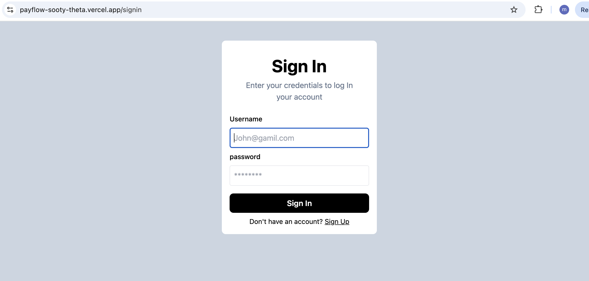
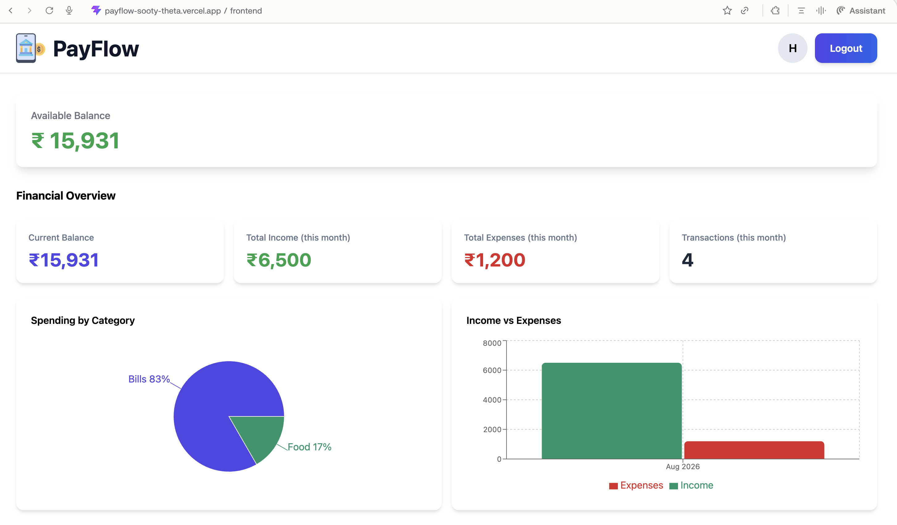
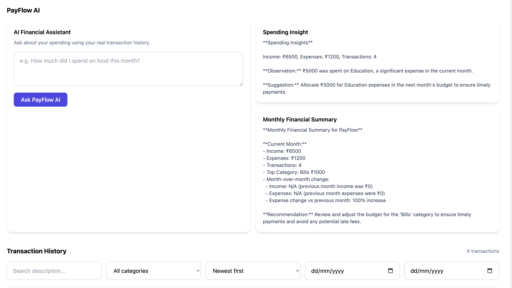
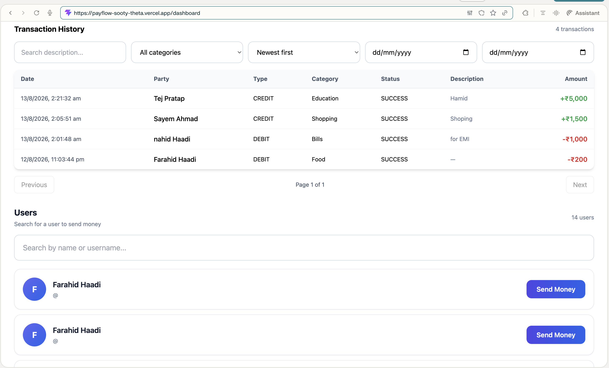

 # 💸 PayFlow

> A full-stack digital payment and personal finance management platform with AI-powered financial insights.

PayFlow is a modern full-stack payment application designed to simulate real-world digital wallet functionality while providing users with powerful financial analytics and AI-powered insights.

Users can create accounts, manage their wallet balance, transfer money, track transactions, analyze spending patterns, and interact with an AI financial assistant.

---

## 🚀 Live Demo

**Frontend:** https://payflow-git-main-mohdfarahidali987-sketchs-projects.vercel.app/signin

**Backend API:** https://payflow-backend-9314.onrender.com


## 📸 Screenshots

### SignUp


### SignIn


### Dashboard
## Dashboard1

 ## Dashboard2
 
 ## Dashboard3
 

### Send Money


---

## 🎥 Demo

[]

 

---

## ✨ Features

### 🔐 Authentication

- User registration and login
- JWT-based authentication
- Protected API routes
- Secure password handling
- Authenticated user sessions

### 💰 Digital Wallet

- Initial wallet balance
- View available balance
- Send money to other users
- Receive money from other users
- Balance updates after transactions

### 💳 Transactions

- Create debit and credit transactions
- Transaction history
- Transaction status tracking
- Transaction descriptions
- Transaction categories
- Search transactions
- Filter by category
- Sort transactions
- Filter transactions by date range
- Pagination

### 📊 Financial Analytics

PayFlow provides a financial dashboard to help users understand their spending.

- Current balance
- Monthly income
- Monthly expenses
- Monthly transaction count
- Spending by category
- Income vs Expenses visualization
- Monthly financial statistics
- Category-wise spending analysis

### 🤖 PayFlow AI

PayFlow includes an AI-powered financial assistant.

#### AI Financial Assistant

Users can ask questions about their transaction history, such as:

> "How much did I spend on food this month?"

The AI generates answers using the user's actual transaction data.

#### AI Spending Insights

PayFlow analyzes spending patterns and generates useful observations about the user's financial activity.

#### Monthly Financial Summary

The AI generates a concise monthly summary containing:

- Total income
- Total expenses
- Top spending category
- Expense change compared with the previous month
- A practical financial recommendation

#### AI Transaction Categorization

Transactions can be automatically categorized using AI into supported categories such as:

- Food
- Travel
- Shopping
- Entertainment
- Education
- Healthcare
- Utilities
- Other

AI functionality is implemented using the Groq API through an OpenAI-compatible SDK interface.

---

## 📈 Dashboard

The PayFlow dashboard provides a centralized view of the user's financial activity.

### Dashboard includes:

- Available balance
- Financial overview
- Spending by category chart
- Income vs expenses chart
- AI financial assistant
- AI spending insight
- Monthly financial summary
- Transaction history
- User search
- Send money functionality

---

## 🛠️ Tech Stack

### Frontend

- React
- TypeScript
- Vite
- Tailwind CSS
- React Router
- Axios
- Recharts
- React Hot Toast

### Backend

- Node.js
- Express.js
- TypeScript
- MongoDB
- Mongoose
- JWT
- Zod
- OpenAPI / Swagger
- REST API

### AI

- Groq API
- OpenAI-compatible SDK
- AI-powered transaction categorization
- AI financial assistant
- AI spending insights
- AI monthly summaries

### Testing

- Vitest
- Supertest
- MongoDB Memory Server

### Deployment

- Vercel — Frontend
- Render — Backend
- MongoDB Atlas — Database

---

## 🏗️ Project Architecture

```text
                 ┌──────────────────────┐
                 │      PayFlow UI      │
                 │ React + TypeScript   │
                 └──────────┬───────────┘
                            │
                            │ REST API
                            ▼
                 ┌──────────────────────┐
                 │    Express Server    │
                 │   Node.js + TS       │
                 └──────────┬───────────┘
                            │
              ┌─────────────┴─────────────┐
              │                           │
              ▼                           ▼
     ┌─────────────────┐        ┌─────────────────┐
     │  MongoDB Atlas  │        │    Groq AI      │
     │   Database      │        │   AI Services   │
     └─────────────────┘        └─────────────────┘

## 👨‍💻 Author

**Muhammed Farahid**

B.Tech CSE | NIT Srinagar

- GitHub: https://github.com/mohdfarahidali987-sketch
- LinkedIn: https://www.linkedin.com/in/muhammed-farahid-95ab3a350/

 
