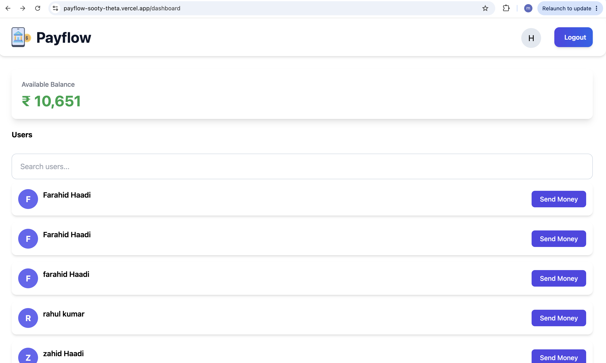
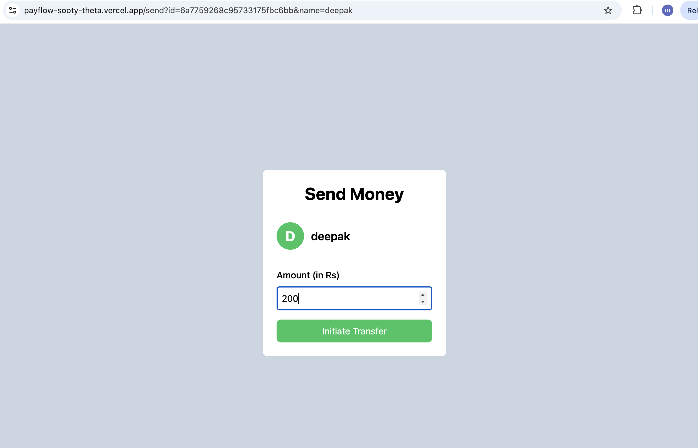

# 💳 Payflow


A modern full-stack digital payment application built with the MERN stack that allows users to securely manage their accounts and transfer money in real time.


## 🌐 Live Demo

🔗 https://payflow-sooty-theta.vercel.app

---

## 🎥 Demo Video

Watch a complete walkthrough of the application:

▶️ [PayFlow Demo](https://github.com/mohdfarahidali987-sketch/payflow/blob/main/demo/payflow-demo.mp4)

---

## 📸 Screenshots

### Dashboard



---

### Sign In


---

### Sign Up


---

### Send Money




## ✨ Features

- 🔐 JWT Authentication
- 🔒 Protected Routes
- 👤 User Registration & Login
- 💰 Account Balance Management
- 💸 Secure Money Transfer
- 🔍 User Search
- 🚪 Logout
- 🍞 Toast Notifications
- ⚡ Axios API Instance
- 🛡️ Request & Response Interceptors
- 🎨 Responsive UI with Tailwind CSS

## 🛠 Tech Stack

### Frontend

- React
- TypeScript
- Tailwind CSS
- React Router
- Axios
- React Hot Toast

### Backend

- Node.js
- Express.js
- TypeScript
- JWT
- bcrypt
- Zod

### Database

- MongoDB
- Mongoose


## 📁 Project Structure

```text
Payflow/
├── frontend/
│   ├── src/
│   │   ├── components/
│   │   ├── pages/
│   │   ├── lib/
│   │   └── hooks/
│   └── public/
│
└── backend/
    ├── src/
    │   ├── routes/
    │   ├── middleware/
    │   ├── models/
    │   ├── validations/
    │   └── config/
    └── package.json
```


## 🚀 Installation

### Clone the repository

```bash
git clone https://github.com/mohdfarahidali987-sketch/payflow.git
cd payflow
```

### Frontend

```bash
cd frontend
npm install
npm run dev
```

### Backend

```bash
cd backend
npm install
npm run dev
```

---

## 🔑 Environment Variables

### Backend

Create a `.env` file inside the `backend` folder.

```env
MONGO_URL=your_mongodb_connection_string
JWT_SECRET=your_secret_key
PORT=3000
```

### Frontend

Create a `.env` file inside the `frontend` folder.

```env
VITE_BACKEND_URL=http://localhost:3000
```

---

## 📡 API Endpoints

### User

```http
POST /api/v1/user/signup
POST /api/v1/user/signin
GET  /api/v1/user/me
GET  /api/v1/user/bulk
```

### Account

```http
GET  /api/v1/account/balance
POST /api/v1/account/transfer
```

---

## 🚀 Future Improvements

- Email Verification
- Transaction History
- Profile Management
- Dark Mode
- Admin Dashboard
- Search Debouncing
- Real-time Notifications
- Unit Testing

---

## 👨‍💻 Author

**Muhammed Farahid**

B.Tech CSE | NIT Srinagar

- GitHub: https://github.com/mohdfarahidali987-sketch
- LinkedIn: https://www.linkedin.com/in/muhammed-farahid-95ab3a350/

 
